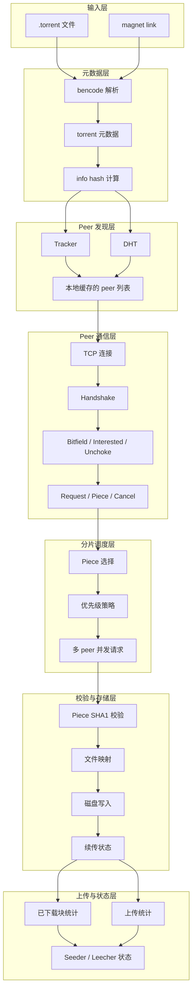

# P2P 网络通信整体架构

下面这张图把一个 BitTorrent / P2P 客户端拆成几个核心层次，方便理解 Week 4 之后要做的内容。

## 这张图怎么理解

- 前两层负责“知道自己要什么”和“知道去哪里找人”
- 中间两层负责“真正跟别人说话”和“决定先下什么”
- 后两层负责“确认数据没坏”和“把文件落到磁盘”
- 最后一层负责上传状态和统计

## 和 Week 的对应关系

- Week 2 / Week 3：元数据层
- Week 4：Peer 发现层，重点是 Tracker
- Week 5：DHT 层
- Week 6：Peer Wire 协议层
- 后续：分片调度、校验、存储、上传
